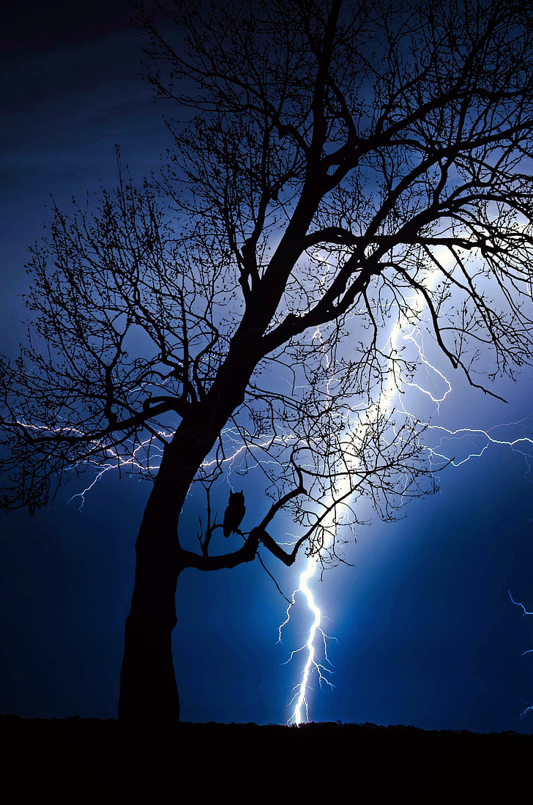

# Individual Approach to Animating the Group Code
### Perlin Noise Driven Animation
I chose to drive my individual code using **Perlin noise**. Perlin noise generates smooth, continuous random values, which I used to animate various properties of the shapes over time. I will make the Perlin noise controlling the size the angle as well as the position.

### Animated Properties
- **Neon Circles:** The position, size, and rotation angle of the neon circles change based on Perlin noise.
- **Neon Semi-Circles:** The position and size of the semi-circles also adapt to the window size and Perlin noise.

- **Neon Circle**- **Neon Rectangles** - **Neon Semi-Circles**  Are all could be adapted as the window resizing.(Including the background and effect)

### Unique Elements
- **Lightning Effect:** Randomly triggered lightning flashes change the background color to white, adding a dynamic visual element.
- **Rain Effect:** Simulated raindrops create a sense of movement and atmosphere.

### Inspiration References
- **Glow Effect:** The glow effect technique was inspired by a YouTube tutorial. This effect enhances the neon appearance of the shapes and adds a vibrant visual appeal to the animation.
  - [YouTube Tutorial](https://www.youtube.com/watch?v=iIWH3IUYHzM)
  - [YouTube Tutorial Part 2](https://www.youtube.com/watch?v=iIWH3IUYHzM&t=115s)
- **Idea Inspiration:** Because the apple tree in this artist's painting doesn't look like a traditional apple tree, I used the Perlin noise function to make it look very weird when it moves, so I chose the horror route, making the tree look like a living tree demon, and then added some heavy rain and lightning scenes that are common in horror movies to increase the sense of horror.
- 
  - [Image reference](https://www.pickpik.com/thunder-background-picture-thunderstorm-flash-weather-51286)

## Technical Explanation
#### Perlin Noise Integration
- **Position Adjustment:** The `draw` method of each shape class adjusts the x and y positions based on Perlin noise values.
- **Size Variation:** The size of the shapes is modified by Perlin noise, giving them a natural, organic feel.
- **Angle Change:** The rotation angles of the circles are influenced by Perlin noise, creating smooth, continuous rotation.

#### Additional Techniques
- **Glow Effect:** Applied using shadow blur and shadow color settings in the drawing context.
- **Dynamic Scaling:** Shapes adjust their size and position based on the current window dimensions, ensuring the animation is responsive to different screen sizes.

#### Code Changes
- Significant modifications were made to integrate Perlin noise for animating properties and implementing the lightning and rain effect by using the random function

## Usage of External Tools and Techniques
- **Glow Effect:** The glow effect technique was adopted from online tutorials. It involves setting the shadow blur and shadow color in the drawing context to create a neon-like glow around the shapes.

## Conclusion
This individual approach to the group animation project leverages Perlin noise to create a dynamic, visually appealing animation. The unique elements of lightning and rain, combined with the neon glow effect, make this animation stand out.